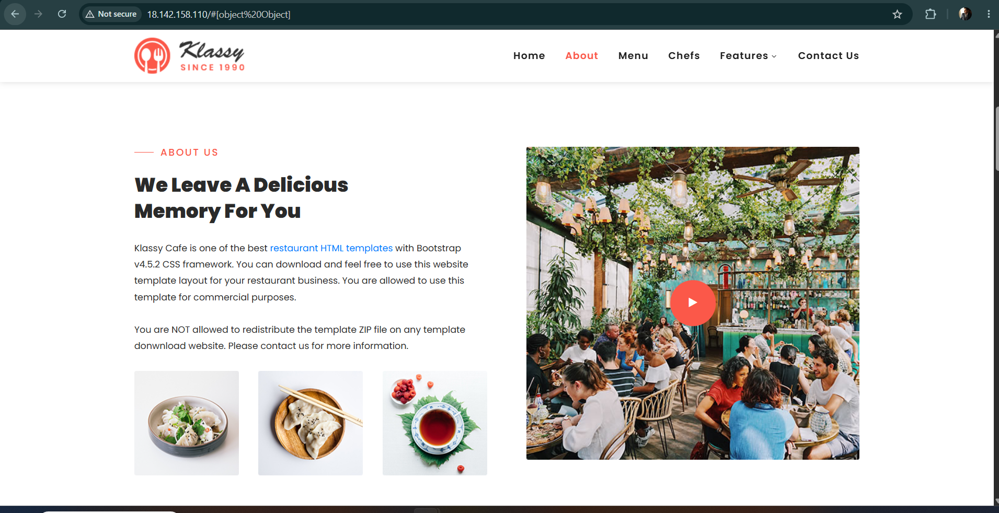

# Terraform-AWS-EC2-Static-Website-Project
---
                    Terraform
                        │
                        ▼
                       AWS
                        │
                        ▼
                  EC2 Instance
                  Ubuntu Linux
                        │
             ┌──────────┴──────────┐
             │                     │
          Nginx                   Git
             │                     │
             └──────────┬──────────┘
                        │
                        ▼
                 GitHub Repository
                 abhipraydhoble/
                    templates
                        │
                        ▼
                  Selected folder
                     e.g. cafe
                        │
                        ▼
                  /var/www/html
                        │
                        ▼
                     Nginx
                        │
                        ▼
                  🌐 our Website

---
Final project structure
---
terraform-aws-ec2/
│
---
├── provider.tf
---
├── variables.tf
---
├── terraform.tfvars
---
├── security-group.tf
---
├── ec2.tf
---
└── outputs.tf
---
 Project Screenshot 
---

